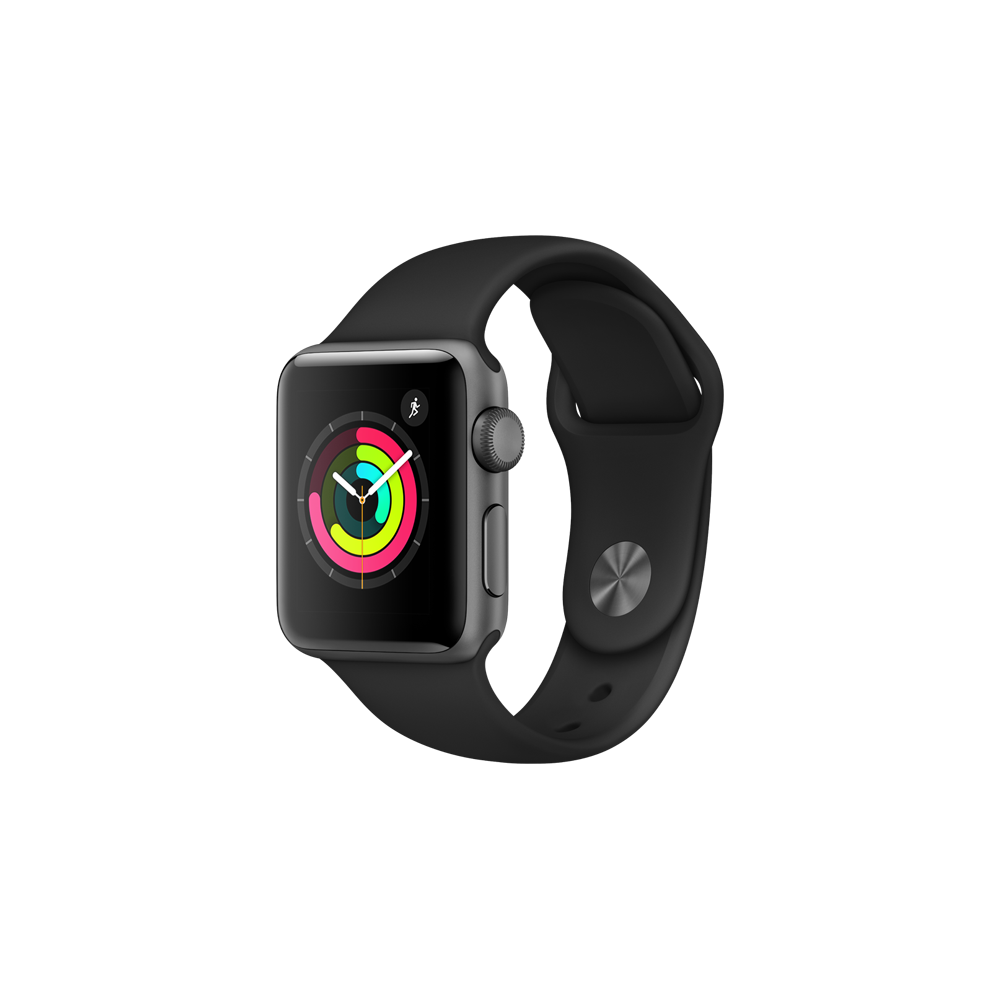
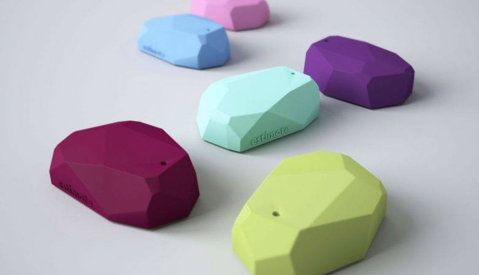

Wij kozen voor de iPhone 6/6s/7/8 & de Apple Watch.  
Ze zijn gemakkelijk te verbinden met elkaar, bezitten alle speci caties die we nodig hadden in ons concept, goed qua design, ... 
 
<h4>Smartwatch: Watch Series 3 38mm</h4>
Je kunt in- en uitzoomen op de apps met de Digital Crown, de ronde draaiknop aan de zijkant van de horlogekast. Ook kun je rondbladeren door je vinger over het scherm te vegen. Met de platte zijknop open je je favoriete of meest recente apps.

<h5>Display</h5>
- OLED Retina-display (2e generatie) met Force Touch
- 2x helderder (1000 nits)
- Ion‑X-glas
- 272 x 340 pixels

<h5>Knoppen</h5>
- Digital Crown/ home button
- zijknop

<h5>Sensoren</h5>
- GPS, GLONASS, Galileo en QZSS
- Barometrische hoogtemeter
- Gyroscoop

<h5>Besturingssysteem</h5>
WatchOS 
- Besturingssysteem van de Apple Watch, het slimme horloge van Apple. 
- Voor het eerst verschenen op 24 april 2015.
- Meest recente versie is watchOS 4.
- Eerstvolgende versie watchOS 5 staat gepland voor najaar 2018.
watchOS is te vergelijken met iOS op een iPhone of iPad. 

<h5>Functies</h5>
De Apple Watch heeft twee belangrijke schermen: de wijzerplaat en het startscherm voor de apps. Dit startscherm ziet eruit als een honingraatpatroon. Als je wilt kun je de appiconen extra groot weerge- ven. Vanaf watchOS 4 is er ook een lijstweergave voor apps. 
Je kunt in- en uitzoomen op de apps met de Digital Crown, de ronde draaiknop aan de zijkant van de horlogekast. Ook kun je rondbladeren door je vinger over het scherm te vegen. Met de platte zijknop open je je favoriete of meest recente apps. 

<h5>Ontwerprichtlijnen</h5>
- Gegevens weergeven die nuttig en relevant zijn.
- Bepaal welke gegevens moeten worden weergegeven en wanneer deze moeten worden weergegeven
- Houd voorgrondmuziek en videos kort.
- Geef visuele feedback in reactie op Digital Crown-interacties
- Maak titels kort en gemakkelijk te begrijpen

<h4>Smartphone: Iphone 8</h4>

<h5>Display</h5>
- Retina HD display
- 4,7‑inch (diagonaal) lcd-breedbeeld­display met Multi‑Touch en IPS-technologie
- Resolutie van 1334 x 750 pixels bij 326 ppi
- Contrast­verhouding 1400:1 (standaard)
- True Tone-weergave
- Brede kleurweer­gave (P3)
- Max. helderheid 625 cd/m2 (standaard)

<h5>Knoppen</h5>
- Touch-ID sensor
- Volume harder en zachter
- Geluid aan/uit
- Ingebouwde stereopeaker
- Aan/uiknop

<h5>Camera</h5>
- 12 Mp camera
- Diafragma ƒ/1.8
- Tot 5x digitale zoom

<h5>Sensoren</h5>
- Assisted GPS, GLONASS, Galileo en QZSS
- Digitaal kompas
- Wifi
- Mobiel netwerk
- iBeacon voor microlocatie-toepassingen
- Touch-ID sensor

<h5>Besturingssysteem</h5>
IOS 
- Besturingssysteem van de iPhone. 
- Voor het eerst verschenen op 9 jan 2007.
- Meest recente versie is IOS 11.
- Eerstvolgende versie IOS 12 staat gepland voor najaar 2018.
 

<h5>Functies</h5>
- Met augmented reality kunnen apps meeslepende, aantrekkelijke ervaringen bieden die realistische virtuele objecten naadloos laten overvloeien met de echte wereld.
- Gevulde vormen en dikkere lijndiktes houden pictogrammen minimaal, terwijl het contrast wordt verbeterd.
- Uw app kan worden geïntegreerd met de biometrische beveiligingsfuncties van het systeem om een ​​veilige, vertrouwde authenticatie te bieden die mensen vertrouwen.
- Apps die worden uitgevoerd op ondersteunde apparaten kunnen draadloos gegevens lezen van elektronische tags die zijn gekoppeld aan real-world objecten.

<h5>Ontwerprichtlijnen</h5>
- Zorg voor hoge resolutie foto's voor je app
- zorg voor een volledig scherm experience
- Houd rekening met de statusbalkhoogte.
- Vermijd het expliciet plaatsen van interactieve bedieningselementen helemaal onderaan het scherm en in hoeken.
- Gebruik de knoppen voor de volledige breedte
- Om de duidelijkheid en context te verbeteren tijdens het browsen en zoeken, kunnen apps navigatiebalken met grote, vetgedrukte titels implementeren.

<h4>Beacons:</h4>

Draadloos apparaat —> via bluetooth signalen uitzenden  
Kleine kastjes (tussen de 10-30 euro). 
Je hebt een smartphone-app nodig  
Ze werken op batterijen 
 
Op de smartphone kunnen locatiegebaseerde notificaties ontvangen worden. 
 
Het is al in gebruik in musea. 
 
Het is gelijkaardig met de QR-codes, maar bij QR-codes moet de gebruiker wel iets doen, namelijk de code scannen.

