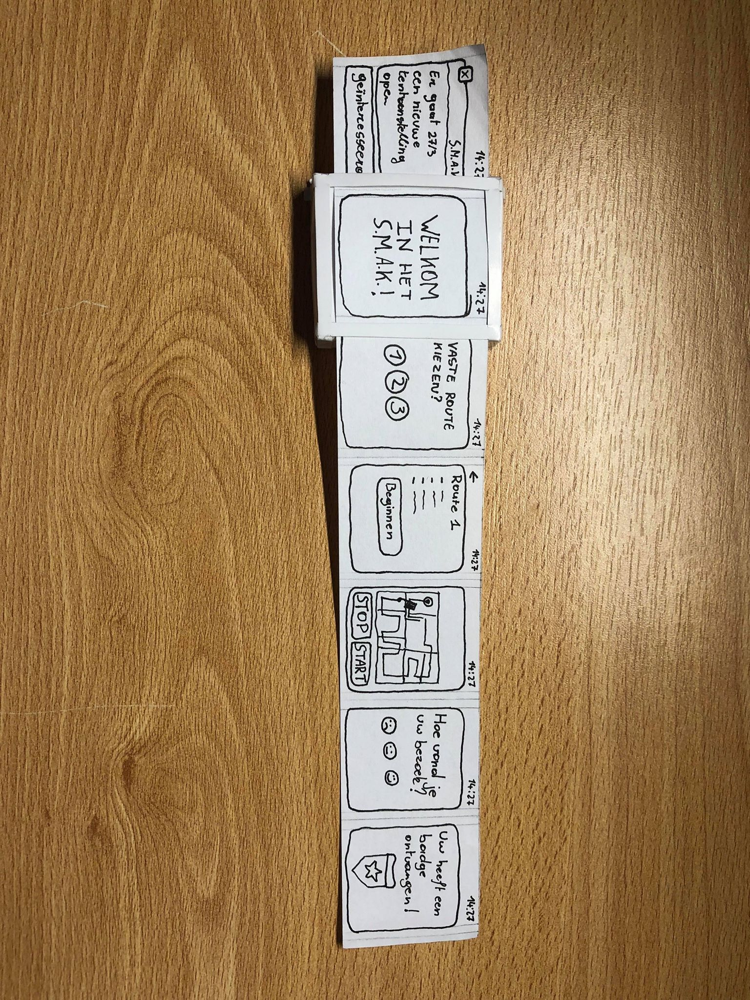

Paper Prototype
---------------

Gebruikerstests
---------------

De test gebeurde met het Paper Prototype en de Wireflow op papier tegelijk.  

<h4>Conclusie:</h4>

- Welke info bij de routes?
- Waar kom ik na ‘Hoe vond je uw bezoek?’
- Badge ontvangen en wat erna? 
- Badge verkeerd geschreven
- Kruisje weg bij eerste scherm, gewoon swipen naar boven
- Hoe weet ik wat welke route doet
- Weinig schermen